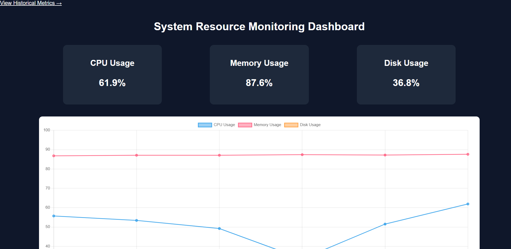
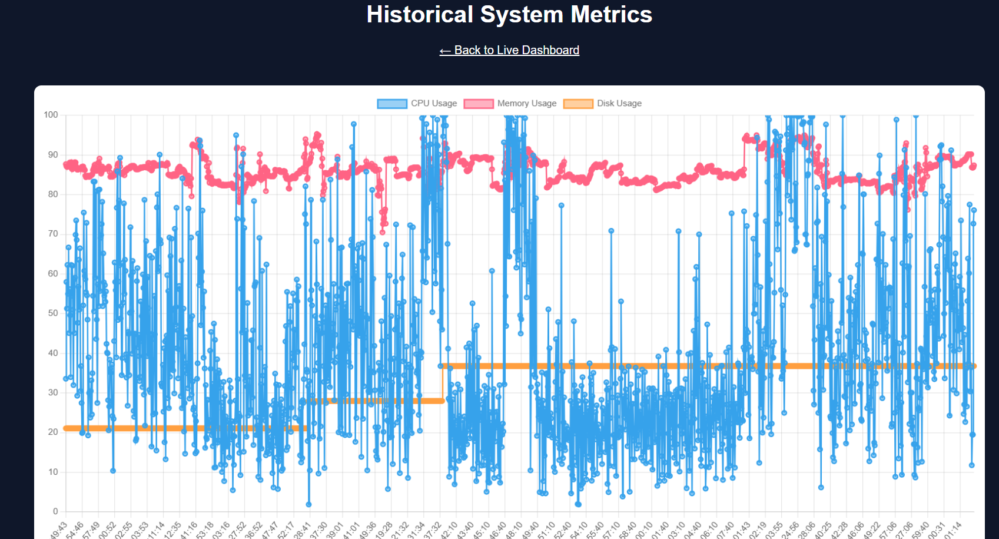
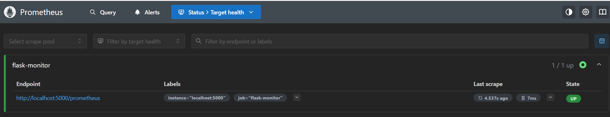
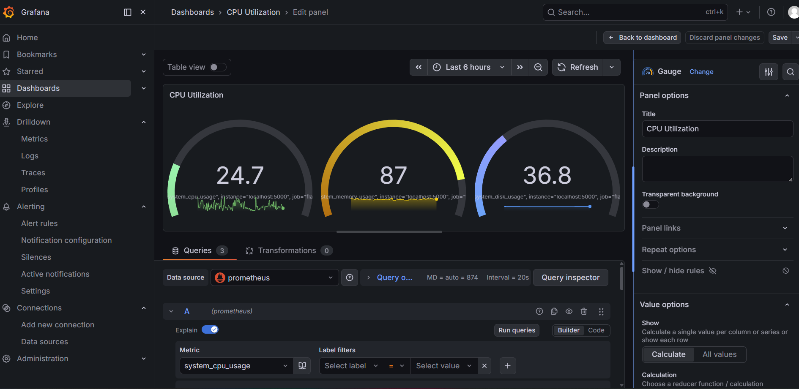

<div align="center">

# ⚡ SRE Monitoring Dashboard

**A real-time system observability and incident detection platform built with Flask, Prometheus, and Grafana.**

[](https://python.org)
[](https://flask.palletsprojects.com)
[](https://prometheus.io)
[](https://grafana.com)
[](https://docker.com)
[](LICENSE)

<br/>



</div>

---

## 📋 Table of Contents

- [Overview](#-overview)
- [Key Features](#-key-features)
- [Architecture](#-architecture)
- [Tech Stack](#-tech-stack)
- [Getting Started](#-getting-started)
- [API Reference](#-api-reference)
- [Prometheus Metrics](#-prometheus-metrics)
- [Alerting Rules](#-alerting-rules)
- [Security Considerations](#-security-considerations)
- [Screenshots](#-screenshots)
- [Project Structure](#-project-structure)
- [Future Roadmap](#-future-roadmap)
- [Contributing](#-contributing)
- [License](#-license)

---

## 🔍 Overview

This project implements a **Site Reliability Engineering (SRE) Monitoring Dashboard** that provides real-time visibility into host-level system metrics. It demonstrates core SRE principles including:

- **Observability** — Structured metrics collection, logging, and visualization
- **Alerting** — Threshold-based incident detection with configurable SLIs
- **Reliability** — Health/readiness probes for container orchestration
- **Security** — OWASP-compliant response headers, least-privilege containers

The dashboard scrapes CPU, memory, disk, network, and process telemetry every few seconds and exposes it through multiple interfaces: a live web dashboard, a Prometheus-compatible endpoint, and a historical data view with CSV persistence.

---

## ✨ Key Features

| Feature | Description |
|---------|-------------|
| 📊 **Live Dashboard** | Real-time metric cards with animated Chart.js visualizations |
| 🔥 **Prometheus Integration** | OpenMetrics-compatible `/prometheus` scrape endpoint |
| 📈 **Historical Analysis** | CSV-backed time-series data with trend visualization |
| 🚨 **Smart Alerting** | Configurable CPU/memory thresholds with visual + Prometheus alerts |
| 💚 **Health Probes** | `/health` (liveness) and `/ready` (readiness) endpoints for K8s |
| 🖥️ **System Info API** | `/system` endpoint exposes host metadata for asset inventory |
| 🔒 **Security Headers** | X-Content-Type-Options, X-Frame-Options, CSP headers on all responses |
| 📦 **Dockerized** | Multi-container deployment with Docker Compose |
| 📉 **Request Instrumentation** | HTTP latency histograms and request counters per endpoint |


---

## 🏗️ Architecture

```
┌──────────────┐     scrape /prometheus     ┌──────────────────┐
│              │ ◄──────────────────────────►│                  │
│  Flask App   │                            │    Prometheus     │
│  (port 5000) │     metrics + alerts       │    (port 9090)    │
│              │                            │                  │
└──────┬───────┘                            └────────┬─────────┘
       │                                             │
       │  JSON /metrics                              │ data source
       ▼                                             ▼
┌──────────────┐                            ┌──────────────────┐
│              │                            │                  │
│  Web Browser │                            │     Grafana      │
│  Dashboard   │                            │   (port 3000)    │
│              │                            │                  │
└──────────────┘                            └──────────────────┘
       │
       │  CSV append
       ▼
┌──────────────┐
│ metrics.csv  │ ── Historical Data Store
└──────────────┘
```

**Data Flow:**
1. Flask app samples host metrics via `psutil` and updates Prometheus gauges
2. The web dashboard polls `/metrics` (JSON) every 3 seconds for live updates
3. Prometheus scrapes `/prometheus` (OpenMetrics) every 5 seconds for time-series storage
4. Grafana queries Prometheus for rich dashboard visualizations
5. Every sample is appended to `metrics.csv` for historical analysis

---

## 🛠️ Tech Stack

| Layer | Technology | Purpose |
|-------|-----------|---------|
| **Backend** | Python 3.11, Flask | REST API, metrics collection, templating |
| **Metrics** | prometheus_client | OpenMetrics exposition format |
| **System Data** | psutil | Cross-platform system telemetry |
| **Data Store** | pandas, CSV | Historical metrics persistence & analysis |
| **Frontend** | HTML5, CSS3, JavaScript | Responsive dashboard UI |
| **Charting** | Chart.js 4.x | Real-time and historical visualizations |
| **Monitoring** | Prometheus | Time-series metrics scraping & alerting |
| **Visualization** | Grafana | Advanced dashboards and alerting |
| **Containerization** | Docker, Docker Compose | Multi-service deployment |

---

## 🚀 Getting Started

### Prerequisites

- Python 3.9+ (recommended: 3.11)
- pip
- Docker & Docker Compose (optional, for containerized setup)

### Option 1: Local Development

```bash
# Clone the repository
git clone https://github.com/SwarnaTripathi/SRE-Monitoring-Dashboard.git
cd SRE-Monitoring-Dashboard

# Create virtual environment
python -m venv venv
source venv/bin/activate        # Linux/Mac
venv\Scripts\activate           # Windows

# Install dependencies
pip install -r requirements.txt

# Run the application
python app.py
```

Open **http://localhost:5000** in your browser.

### Option 2: Docker Compose (Full Stack)

```bash
# Start all services (Flask + Prometheus + Grafana)
docker-compose up --build -d

# Check status
docker-compose ps
```

| Service | URL |
|---------|-----|
| Dashboard | http://localhost:5000 |
| Prometheus | http://localhost:9090 |
| Grafana | http://localhost:3000 (admin/admin) |

### Environment Variables

| Variable | Default | Description |
|----------|---------|-------------|
| `ALERT_CPU_THRESHOLD` | `80` | CPU usage % to trigger alert |
| `ALERT_MEMORY_THRESHOLD` | `90` | Memory usage % to trigger alert |
| `METRICS_LOG` | `metrics.csv` | Path to CSV metrics log |
| `SCRAPE_INTERVAL` | `3` | Frontend polling interval (seconds) |

---

## 📡 API Reference

| Endpoint | Method | Description |
|----------|--------|-------------|
| `/` | GET | Live monitoring dashboard (HTML) |
| `/metrics` | GET | Current system metrics (JSON) |
| `/prometheus` | GET | Prometheus-compatible scrape endpoint |
| `/history` | GET | Historical metrics view (HTML) |
| `/health` | GET | Liveness probe — is the app running? |
| `/ready` | GET | Readiness probe — can it serve traffic? |
| `/system` | GET | Static host metadata (JSON) |

### Example: `/metrics` Response

```json
{
  "cpu": 23.5,
  "memory": 67.2,
  "disk": 54.8,
  "swap": 12.0,
  "net_sent_mb": 1024.56,
  "net_recv_mb": 2048.12,
  "processes": 312,
  "memory_total_gb": 16.0,
  "memory_used_gb": 10.75,
  "disk_total_gb": 512.0,
  "disk_used_gb": 280.72,
  "time": "14:32:05",
  "alerts": []
}
```

---

## 📊 Prometheus Metrics

### System Metrics (Gauges)

| Metric Name | Type | Description |
|-------------|------|-------------|
| `system_cpu_usage_percent` | Gauge | CPU utilization % |
| `system_memory_usage_percent` | Gauge | Memory utilization % |
| `system_disk_usage_percent` | Gauge | Disk utilization % |
| `system_swap_usage_percent` | Gauge | Swap utilization % |
| `system_network_bytes_sent_total` | Gauge | Total network bytes sent |
| `system_network_bytes_recv_total` | Gauge | Total network bytes received |
| `system_process_count` | Gauge | Running process count |
| `system_boot_time_seconds` | Gauge | Boot timestamp (UNIX epoch) |
| `active_alerts_total` | Gauge | Currently active alert count |

### Application Metrics

| Metric Name | Type | Description |
|-------------|------|-------------|
| `http_requests_total` | Counter | Total HTTP requests (by method, endpoint, status) |
| `http_request_duration_seconds` | Histogram | Request latency distribution |

---

## 🚨 Alerting Rules

Pre-configured Prometheus alerting rules in [`alerting_rules.yml`](alerting_rules.yml):

| Alert | Condition | Severity | Duration |
|-------|-----------|----------|----------|
| HighCPUUsage | CPU > 80% | ⚠️ Warning | 2 min |
| CriticalCPUUsage | CPU > 95% | 🔴 Critical | 1 min |
| HighMemoryUsage | Memory > 90% | ⚠️ Warning | 2 min |
| DiskSpaceRunningLow | Disk > 85% | ⚠️ Warning | 5 min |
| DiskSpaceCritical | Disk > 95% | 🔴 Critical | 1 min |
| HighRequestLatency | p95 latency > 1s | ⚠️ Warning | 5 min |

---

## 🔒 Security Considerations

This project implements several security best practices relevant to **InfoSec and SRE**:

- **Security Headers**: Every HTTP response includes `X-Content-Type-Options`, `X-Frame-Options`, `X-XSS-Protection`, `Referrer-Policy`, and `Permissions-Policy` headers
- **Non-Root Container**: The Dockerfile creates and runs as a non-root `appuser` (principle of least privilege)
- **Pinned Dependencies**: All Python packages are version-pinned in `requirements.txt` to prevent supply-chain attacks
- **No Secrets in Code**: Sensitive values are loaded from environment variables, never hardcoded
- **`.gitignore` Protection**: `.env`, `*.pem`, `*.key` files are excluded from version control
- **Input Validation**: API endpoints use structured responses and avoid user-supplied template injection
- **Health Check Isolation**: Liveness/readiness probes are separated to prevent cascading failures

---

## 📸 Screenshots

<div align="center">

| Live Dashboard | Historical View |
|:-:|:-:|
|  |  |

| Prometheus Targets | Grafana Dashboard |
|:-:|:-:|
|  |  |

| Grafana Alerts |
|:-:|
|  |

</div>

---

## 📁 Project Structure

```
SRE-Monitoring-Dashboard/
├── screenshots/                  # Dashboard screenshots
├── static/
│   └── style.css                 # Dashboard styling
├── templates/
│   ├── index.html                # Live dashboard page
│   └── history.html              # Historical metrics page
├── alerting_rules.yml            # Prometheus alerting rules
├── app.py                        # Flask application (main)
├── docker-compose.yml            # Multi-container orchestration
├── Dockerfile                    # Container image definition
├── LICENSE                       # MIT License
├── prometheus.yml                # Prometheus scrape config
├── README.md                     # Project documentation
└── requirements.txt              # Python dependencies (pinned)
```

---

## 🗺️ Future Roadmap

- [ ] **Slack/PagerDuty Integration** — Route alerts to incident response channels
- [ ] **Email Notifications** — SMTP-based alerting for threshold breaches
- [ ] **Kubernetes Deployment** — Helm chart with HPA and pod monitoring
- [ ] **Log Aggregation** — ELK/Loki integration for structured log analysis
- [ ] **Multi-Node Monitoring** — Agent-based collection from multiple hosts
- [ ] **RBAC Dashboard** — Role-based access control for multi-tenant environments
- [ ] **SSL/TLS Termination** — HTTPS support with certificate management
- [ ] **Rate Limiting** — API endpoint protection against abuse

---

## 🤝 Contributing

Contributions are welcome! Please follow these steps:

1. Fork the repository
2. Create a feature branch (`git checkout -b feature/amazing-feature`)
3. Commit your changes (`git commit -m 'Add amazing feature'`)
4. Push to the branch (`git push origin feature/amazing-feature`)
5. Open a Pull Request

---

## 📄 License

This project is licensed under the MIT License — see the [LICENSE](LICENSE) file for details.

---

<div align="center">

**Built with ❤️ by [Swarna Tripathi](https://github.com/SwarnaTripathi)**

*Designed to demonstrate SRE & InfoSec fundamentals — observability, reliability, and security.*

</div>